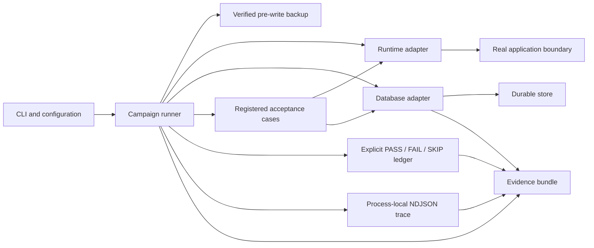

# Live Runtime Acceptance Rig

A small Python framework for exercising a real application boundary, verifying
durable effects in its backing store, and exporting reviewable evidence.

> **A run with one failed acceptance check can still represent a successful test
> campaign if the framework correctly detected, preserved, and reported a real
> defect.**

This project is a practical composition of established acceptance-testing,
database-safety, and observability techniques. It does not claim a new testing
category or replace a project's existing test suite.

## What problem it solves

Unit tests prove components. Integration tests prove selected collaborations.
End-to-end tests often prove what a client observed. Those tests may still leave
important questions unanswered:

- Did the request traverse the intended live application boundary?
- Did the durable record contain the exact run marker and expected state?
- Was a database backup verified before the first acceptance write?
- Did protected configuration or fixture state change unexpectedly?
- Can a reviewer inspect evidence after a partial or failing campaign?
- Can every test-created object be identified without a broad cleanup query?

The rig makes those questions explicit and records the answers.

## Terminology

- **Runtime execution success:** the framework completed its campaign and wrote
  evidence without an unhandled framework error.
- **Acceptance pass/fail:** the tested system did or did not satisfy every
  non-skipped acceptance check.
- **Heuristic assertion:** a deliberately labeled, non-exact judgment. Exact
  status codes, identifiers, and database values should be preferred.
- **Durable readback:** verifying a result from the real backing store or file,
  rather than trusting only an API response.
- **Protected state:** data that a campaign must observe but must not alter.
- **Cleanup manifest:** a list of resources created by exactly one run, including
  identifiers and narrowly scoped cleanup instructions.

## Architecture



Application-specific knowledge stays in adapters and cases. The framework does
not inspect private registries or depend on internal implementation attributes.

The framework does not automatically understand arbitrary applications or
databases. Adopters must implement or configure application-specific runtime
and database adapters, then register acceptance cases for their own contracts.

## Quick start

Python 3.10 or newer is required. The reusable core has no third-party runtime
dependencies. The `example` extra installs FastAPI and HTTPX; the `dev` extra
installs the example dependencies plus pytest.

```bash
python -m pip install -e ".[dev]"
python -m live_runtime_rig_examples.fastapi_sqlite.seed --database var/work_orders.db
python -m live_runtime_rig --config examples/fastapi_sqlite/.env.example --public-safe
```

The second command is the normal passing campaign. The installed command is
equivalent and can be run from another directory when the configuration path is
absolute:

```bash
live-runtime-rig --config /absolute/path/to/examples/fastapi_sqlite/.env.example --public-safe
```

For your own application, copy `.env.example`, replace the adapter and case
references, and implement the contracts described below.

## Running the toy example

The included example is an unrelated FastAPI and SQLite work-order service. It
runs in-process and does not use the public network.

Seed the toy database explicitly before the first campaign:

    python -m live_runtime_rig_examples.fastapi_sqlite.seed --database var/work_orders.db

Passing campaign:

```bash
python -m live_runtime_rig --config examples/fastapi_sqlite/.env.example --public-safe
```

**EXPECTED DEMONSTRATION FAILURE — EXITS WITH STATUS 1 BY DESIGN**

```bash
python -m live_runtime_rig --config examples/fastapi_sqlite/intentional-failure.env --public-safe
```

The latter command exits `1`, but the framework status remains `COMPLETED` and
the evidence bundle records the deliberate `FAIL`.

## CLI

```text
python -m live_runtime_rig --config PATH
    [--quiet | --verbose]
    [--case NAME_OR_SUITE]
    [--public-safe]
    [--allow-env-overrides]
    [--cleanup-manifest-only]
```

- `--quiet` prints only the final framework/result summary.
- `--verbose` prints expected, observed, and evidence detail for each check.
- `--case` selects one exact case name or suite.
- `--public-safe` redacts sensitive values and local paths in textual evidence.
- `--allow-env-overrides` explicitly permits ambient `RIG_*` values to override the configuration file and records their provenance.
- `--cleanup-manifest-only` writes an empty current-run manifest and complete
  evidence skeleton without starting either adapter.

No listed flag is a placeholder.

## Adapting a real runtime

Implement `RuntimeAdapter` from `live_runtime_rig.contracts`:

1. `start()` opens the actual application boundary or test client.
2. `health()` returns a mapping with `ready` set to an exact boolean.
3. `request()` sends requests through that boundary.
4. `direct_readiness_probe()` performs a non-mutating readiness check.
5. `list_capabilities()` reports stable, public-safe capability labels.
6. `close()` releases the runtime even after a failing case.

Prefer the same boundary used by the real client. An in-process client is useful
when it runs the application's genuine routes and lifecycle. A remote adapter is
also possible, but network safety and authentication become project concerns.

## Adapting a real database

Implement `DatabaseAdapter` from `live_runtime_rig.contracts`.

- Verify connectivity without writes.
- Use engine-native consistent backup facilities.
- Return a structured `BackupProof`; file proofs are independently checked against the exact destination, size, hexadecimal SHA-256, and targeted integrity result.
- Provide an explicit `BackupVerifier` for remote or non-file snapshots.
- Use read-only connections for snapshots where the engine supports them.
- Strictly allowlist any interpolated table identifiers.
- Parameterize all record values.
- Verify current-run records through durable readback.
- Snapshot protected state before and after.
- Emit cleanup entries containing exact identifiers and the run marker.
- Implement `close()` for adapter lifecycle cleanup.
- Do not initialize, migrate, or seed durable state during adapter construction.

The toy adapter demonstrates SQLite's native backup API, read-only snapshots,
integrity verification, SHA-256, strict table allowlisting, and parameterized
record queries.

## Adding a case

A case has `name`, `suite`, and `run(runtime, database, context)`. It returns a
`CaseResult` containing:

- explicit `CheckSpec` values;
- public-safe case evidence;
- cleanup entries for resources it created;
- optional state updates for later cases.

After each successful mutation, call `context.register_cleanup(entry)` immediately, or use `register_cleanups(entries)` for an atomic batch. `CaseResult.cleanup_entries` remains compatible, but it cannot protect a mutation if the case raises before returning.

Every check chooses `CheckStatus.PASS`, `CheckStatus.FAIL`, or
`CheckStatus.SKIP`. The ledger never converts a generic truthy object into a
passing result.

Prefer checks such as:

- exact HTTP status;
- exact marker and identifier;
- exact durable field value;
- exact count or ordered event set;
- exact before/after protected-state equality.

Mark wording, similarity, or other judgment-based checks as heuristic.

## Safety model

The default model is additive:

1. Generate a unique run marker.
2. Initialize the database adapter.
3. Verify connectivity and integrity.
4. Snapshot durable and protected state.
5. Create and verify a consistent backup.
6. Start the runtime.
7. Create new, marker-scoped resources.
8. Update or archive only resources created by this run.
9. Read durable results back.
10. Compare protected state.
11. Write a cleanup manifest without deleting anything.

The framework never promises that live testing is risk-free. Adapters and cases
can contain mistakes, application behavior can have side effects, and backup
restoration must be tested separately.

## Evidence bundle

Every run creates:

```text
evidence/<run-id>/
    run.json
    report.md
    summary.txt
    trace.ndjson
    environment.json
    database_before.json
    database_after.json
    cleanup_manifest.json
    backups/
    cases/
    artifacts/
    errors/
```

The structure is created before preflight work so an early failure still leaves
a usable bundle. `run.json` separates `framework_status` from `acceptance_status` and includes a machine-readable `result_code`. Empty and all-skipped campaigns are `INCONCLUSIVE`. All evidence destinations and programmatic run IDs are constrained beneath the configured evidence root.

## Tracing

The NDJSON tracer records:

- UTC timestamp;
- monotonically increasing sequence number;
- run ID;
- generic event name;
- optional suite and case;
- span elapsed time;
- safe exception type.

Protected text is not logged by default. Use
`context.tracer.protected_text_metadata(text)` to record only character length and a per-run keyed HMAC-SHA256 digest. Runtime-owned trace fields are reserved and collision attempts are rejected.

## Cleanup manifests

The framework records only resources declared by the current case and rejects a cleanup entry whose marker differs from the current run marker or whose identifier is empty. Registration is persisted immediately, duplicate entries are suppressed, and an invalid batch leaves the manifest unchanged.

Each entry contains the resource type, identifier, table or path, marker, notes,
callback key, and a narrow cleanup instruction. No cleanup executes
automatically. Review the manifest and use an adapter-specific callback that
checks both identifier and marker.

Never translate a manifest into an unscoped deletion.

## Redaction and public-safe mode

Public-safe mode redacts configured secret values, authorization values, common
secret assignments, bearer tokens, absolute local paths, and selected sensitive
environment values. It also omits exception messages and tracebacks from public
error evidence.

Structured evidence accepts only JSON-compatible values, preventing custom objects from bypassing redaction through fallback string conversion.

It does not make arbitrary evidence safe by itself. Before publication, manually
review:

- every adapter and case;
- all text evidence;
- binary backups;
- fixture data;
- generated identifiers and metadata;
- repository history.

Do not publish a real production database backup.

## Exit codes

- `0`: framework status is `COMPLETED`, the campaign executed at least one non-skipped acceptance check, and all executed checks passed. Cleanup-manifest-only mode is exempt.
- `1`: acceptance failed, the framework reported an execution error, or the result is `INCONCLUSIVE` because no acceptance check executed.
- `2`: command-line parsing failed.

Individual skipped checks are allowed, but a campaign with only skipped acceptance checks is inconclusive and exits 1.

## Example terminal output

```text
LIVE RUNTIME ACCEPTANCE RIG
Run: ACCEPTANCE_YYYYMMDD_HHMMSS_AB12
Mode: public-safe

[00/05] PREFLIGHT
  [PASS] Database adapter connection verified
  [PASS] Database backup created and verified before writes
  [PASS] Runtime adapter initialized

[01/05] WORK ORDER LIFECYCLE
  [PASS] Create endpoint returned 201
  [PASS] Created work order passed durable readback

FRAMEWORK: COMPLETED
RESULT: FAIL
Passed: 12
Failed: 1
Skipped: 1
Evidence: evidence/ACCEPTANCE_YYYYMMDD_HHMMSS_AB12
```

This output describes a successful framework campaign that preserved a real or
intentional acceptance failure.

## Production database warning

**Testing against production is advanced and dangerous. Use staging unless you
deliberately require live acceptance evidence and understand the consequences.**

A verified backup does not prevent side effects, guarantee recovery, preserve
external systems, or prove that restoration works. Before live use:

- obtain authorization;
- use a dedicated safe account or tenant;
- confirm the exact database and runtime;
- block unintended network and destructive capabilities;
- verify backup restoration separately;
- use additive, uniquely marked records;
- prohibit broad updates and deletes;
- snapshot protected state;
- review cleanup manually;
- retain evidence securely.

## Known limitations

- The framework cannot know whether an adapter points at the intended system.
- Remote backup assurance depends on the explicitly supplied verifier contract.
- It cannot prove a backup is restorable in the target deployment.
- Process-local tracing cannot observe work performed in another process.
- Public-safe redaction cannot identify every project-specific secret.
- Cleanup is intentionally not automatic or generic.
- Adapter code remains trusted, application-specific code.
- SQLite utilities do not generalize to other database engines.
- Binary evidence requires separate manual inspection.

## Publication-safety checklist

- [ ] The example and documentation contain no private product names.
- [ ] Adapter references are public or deliberately fictional.
- [ ] No production routes, schemas, prompts, traces, or evidence are present.
- [ ] No local absolute paths, usernames, hostnames, or private domains remain.
- [ ] No secrets, tokens, authorization values, or environment values remain.
- [ ] Generated evidence was reviewed manually.
- [ ] Binary backups are excluded from publication.
- [ ] Repository history was scanned, if a repository already exists.
- [ ] The full automated test suite passes.
- [ ] Both passing and intentional failing campaigns behave as documented.

## Contributing

See [CONTRIBUTING.md](CONTRIBUTING.md). Keep the core small, adapter-neutral, and
explicit. New examples must be fictional or use openly publishable systems and
data.

Security guidance is in [SECURITY.md](SECURITY.md).

## Attribution and provenance

See [`ATTRIBUTION.md`](ATTRIBUTION.md) for authorship, the established-technique and Nexus verification lineage, external-component boundaries, and permission scope.

## License

Licensed under the Apache License 2.0. See [LICENSE](LICENSE).
